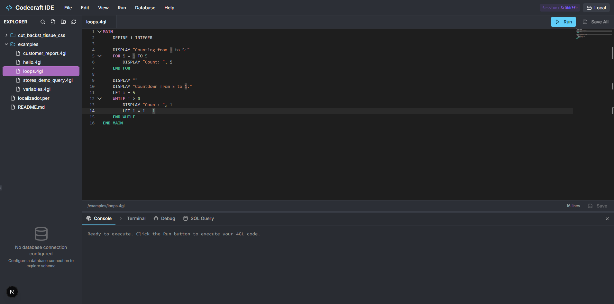

# CodeCraft IDE

[](https://github.com/wanderbatistaf/fglInterpreter/actions)
[](https://www.python.org/downloads/)
[](https://opensource.org/licenses/MIT)
[](https://github.com/psf/black)
[](#testing)

An open-source platform for interpreting, converting, and modernizing legacy Informix 4GL systems. CodeCraft IDE provides a complete ecosystem: a 4GL interpreter, a bidirectional 4GL-Python converter, a modern web IDE (CodeCraft Studio), and an enterprise migration toolkit.

<p align="center">
  
</p>

---

## Why CodeCraft IDE?

Organizations maintaining Informix 4GL systems face rising maintenance costs, a shrinking pool of qualified developers, and limited integration with modern technologies. A full rewrite is risky and expensive. CodeCraft IDE offers a **gradual migration path**: execute, analyze, and convert 4GL code at your own pace, preserving business logic accumulated over decades.

## Features

| Category | Highlights |
|---|---|
| **Interpreter** | Execute 4GL scripts directly in Python &mdash; IF, FOR, WHILE, CASE, FOREACH, DEFINE, LET, DISPLAY, and more |
| **Converter** | Bidirectional 4GL &harr; Python translation with type hints, Black formatting, and SQL translation (wbjdbc / wborm) |
| **CodeCraft Studio** | Next.js web IDE with Monaco editor, 4GL syntax highlighting, .PER form preview, database explorer, SSH terminal, and command palette |
| **Database** | Informix connectivity via wbjdbc/wborm with connection pooling, transactions (BEGIN/COMMIT/ROLLBACK), and SQLCA integration |
| **Migration Toolkit** | Batch conversion, dependency resolution, migration readiness scoring, multi-format reports (text/JSON/Markdown/HTML/JUnit), and CI/CD integration |
| **Static Analysis** | Code diagnostics, cross-reference analysis, and error hints |
| **Remote Development** | SFTP file management and SSH terminal for working on remote 4GL servers |
| **Authentication** | JWT, LDAP, and Keycloak authentication strategies |

## Quick Start

### Docker (Recommended)

```bash
docker compose up
```

Wait ~60s for Informix to initialize on first run, then open:

| Service | URL |
|---|---|
| **CodeCraft Studio** | http://localhost:9002 |
| Backend API docs | http://localhost:8000/api/docs |
| Informix Database | `localhost:9088` |

The Docker setup includes hot-reload and a pre-configured Informix `stores_demo` database.

### Manual Setup

```bash
# Backend
pip install -e ".[api]"
python -m fglinterpreter.api.main
# API at http://localhost:8000

# Studio (Next.js)
cd studio && npm install && npm run dev
# Studio at http://localhost:9002
```

### CLI

```bash
pip install -e .

# Execute a 4GL script
fgl run examples/hello_world.4gl

# Convert a single file
fgl convert script.4gl -o script.py

# Batch convert a directory
fgl batch-convert legacy/ converted/ --resolve-dependencies --report report.html --report-format html

# Validate conversion output
fgl validate-batch legacy/ converted/ --report junit.xml --report-format junit
```

## Architecture

```
CodeCraft IDE
├── src/fglinterpreter/          Python backend
│   ├── lexer/                   Tokenization
│   ├── parser/                  AST construction
│   ├── interpreter/             4GL execution engine
│   ├── converter/               4GL <-> Python translation
│   │   ├── batch.py             Batch conversion & dependency resolution
│   │   ├── sql_translator.py    SQL statement translation
│   │   ├── validator.py         Output validation & regression testing
│   │   └── report_generator.py  Multi-format migration reports
│   ├── per_parser/              .PER form file parser
│   ├── compiler/                4make compilation bridge
│   ├── analyzer/                Static analysis & diagnostics
│   ├── database/                wbjdbc/wborm adapters
│   ├── sftp/                    Remote file management
│   ├── terminal/                SSH terminal backend
│   ├── lycia/                   Lycia FM2 form parser
│   └── api/                     FastAPI REST & WebSocket API
│       └── auth/                Authentication (JWT/LDAP/Keycloak)
├── studio/                      CodeCraft Studio (Next.js)
│   └── src/
│       ├── components/          Editor, terminal, DB explorer, forms...
│       └── contexts/            App state (files, database, session)
├── tests/
│   ├── unit/                    456 unit tests
│   └── integration/             Integration tests
├── examples/                    Sample 4GL scripts
└── docs/                        Documentation & article
```

## SQL Translation Example

**4GL input:**
```sql
MAIN
    DEFINE v_id INTEGER
    DEFINE v_name CHAR(50)

    LET v_id = 100
    SELECT customer_name INTO v_name
        FROM customers WHERE customer_id = v_id
    DISPLAY "Customer:", v_name
END MAIN
```

**Generated Python:**
```python
from fglinterpreter.database.wbjdbc_connector import WBJDBCConnector

db = WBJDBCConnector()

def main() -> None:
    v_id: int = 0
    v_name: str = ""
    v_id = 100

    _sql = "SELECT customer_name FROM customers WHERE customer_id = ?"
    _cursor = db.execute_query(_sql, [v_id])
    _row = _cursor.fetchone()
    if _row:
        v_name = _row[0]

    print("Customer:", v_name)
```

Supports SELECT/INSERT/UPDATE/DELETE with automatic parameterization, INTO mapping, WHERE clauses, and both wbjdbc (direct SQL) and wborm (ORM-style) backends.

## Configuration

Copy `.env.example` to `.env`:

```bash
# Database
INFORMIX_JDBC_URL=jdbc:informix-sqli://localhost:9088/stores_demo
INFORMIX_DB_USER=informix
INFORMIX_DB_PASSWORD=in4mix

# API
LOG_LEVEL=INFO
SECRET_KEY=your-secret-key
```

## Testing

```bash
pip install -e ".[dev]"

pytest                    # All tests
pytest tests/unit         # Unit tests only
pytest --cov=fglinterpreter --cov-report=html   # With coverage
```

## Contributing

1. Fork & clone
2. `pip install -e ".[dev]"` and `pre-commit install`
3. Create a branch, write tests, ensure `pytest` and `black --check .` and `ruff check .` pass
4. Submit a pull request

## Documentation

- [CodeCraft IDE Article (PT-BR)](docs/article/fglInterpreter_Article_PT.md) &mdash; Academic article describing the platform
- [Studio Documentation (EN)](studio/Documentation/en-us/Manual.md) &mdash; Full user manual
- [Studio Documentation (PT-BR)](studio/Documentation/pt-br/Manual.md) &mdash; Manual do usuario
- [Developer Setup](docs/DEVELOPER_SETUP.md) &mdash; Docker & local dev environment
- [Converter Guide](docs/converter.md) &mdash; Migration toolkit reference

## License

MIT &mdash; see [LICENSE](LICENSE).

## Author

**Wanderson Freitas Batista** &mdash; [wbatista.com](https://www.wbatista.com) &mdash; [GitHub](https://github.com/wanderbatistaf)


